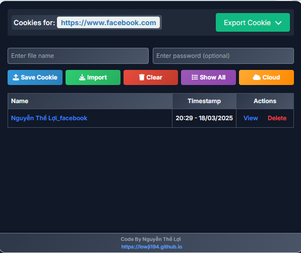

[](README-EN.md)

# Extension Cookie Manager

Extension này giúp bạn quản lý cookie dễ dàng với các chức năng lưu trữ và tải cookie từ Google Drive nếu bạn đã thiết lập API.



## Sử dụng

- Nhấn vào button **Save Cookie** để lưu cookie hiện tại và Upload lên Google Drive nếu bạn đã cài đặt API.
- Nhấn vào button **Cloud** để tải cookie từ Google Drive về Extension.

### Hướng dẫn cài đặt API Appscript (Có thể bỏ qua nếu không sử dụng tính năng Cloud)

1. **Tạo Dự Án Mới Trên Google Apps Script:**
   - Truy cập [Google Apps Script](https://script.google.com/).
   - Nhấn vào nút “New project” để tạo một dự án mới.

2. **Dán Mã API:**
   - Sao chép đoạn mã dưới đây và dán vào trình soạn thảo mã của dự án vừa tạo:

```javascript
var FolderName = "";      // Thay tên thư mục lưu trữ của bạn
var ExpectedKey = "";  // Thay bằng key bảo mật của bạn

function getFolderIdByName(foldername) {
  var folders = DriveApp.getFoldersByName(foldername);
  
  if (folders.hasNext()) {
    var folder = folders.next();
    Logger.log("Folder ID: " + folder.getId());
    return folder.getId();
  } else {
    Logger.log("Không tìm thấy thư mục!");
    return null;
  }
}

function doPost(e) {
  var folderId = getFolderIdByName(FolderName);
  var folder = DriveApp.getFolderById(folderId);
  
  try {
    var params = JSON.parse(e.postData.contents);
    var filename = params.filename;
    var jsonData = params.data;
    var secretKey = params.key;
    
    if (secretKey !== ExpectedKey) {
      return ContentService.createTextOutput(JSON.stringify({"status": "error", "message": "Unauthorized"}))
        .setMimeType(ContentService.MimeType.JSON);
    }
    
    // Tạo blob từ dữ liệu JSON
    var fileBlob = Utilities.newBlob(JSON.stringify(jsonData, null, 2), "application/json", filename);
    
    // Kiểm tra xem file đã tồn tại chưa
    var files = folder.getFilesByName(filename);
    var file;
    
    if (files.hasNext()) {
      // Nếu file tồn tại, xóa file cũ và tạo file mới
      file = files.next();
      file.setTrashed(true); // Xóa file cũ vào thùng rác
      file = folder.createFile(fileBlob); // Tạo file mới
    } else {
      // Nếu file không tồn tại, tạo file mới
      file = folder.createFile(fileBlob);
    }
    
    return ContentService.createTextOutput(JSON.stringify({"status": "success", "fileUrl": file.getUrl()}))
      .setMimeType(ContentService.MimeType.JSON);
  } catch (error) {
    return ContentService.createTextOutput(JSON.stringify({"status": "error", "message": error.toString()}))
      .setMimeType(ContentService.MimeType.JSON);
  }
}

function doGet(e) {
  var folderId = getFolderIdByName(FolderName);
  var folder = DriveApp.getFolderById(folderId);
  
  try {
    var params = e.parameter;
    var secretKey = params.key;
    var filename = params.filename; // Tên file cụ thể nếu được cung cấp
    
    if (secretKey !== ExpectedKey) {
      return ContentService.createTextOutput(JSON.stringify({"status": "error", "message": "Unauthorized"}))
        .setMimeType(ContentService.MimeType.JSON);
    }
    
    if (filename) {
      // Lấy nội dung của một file cụ thể
      var files = folder.getFilesByName(filename);
      if (files.hasNext()) {
        var file = files.next();
        var content = file.getBlob().getDataAsString();
        return ContentService.createTextOutput(JSON.stringify({"status": "success", "data": content}))
          .setMimeType(ContentService.MimeType.JSON);
      } else {
        return ContentService.createTextOutput(JSON.stringify({"status": "error", "message": "File not found"}))
          .setMimeType(ContentService.MimeType.JSON);
      }
    } else {
      // Lấy danh sách và nội dung tất cả các file
      var files = folder.getFiles();
      var fileList = [];
      
      while (files.hasNext()) {
        var file = files.next();
        var content = file.getBlob().getDataAsString(); // Lấy nội dung file
        fileList.push({
          name: file.getName(),
          lastUpdated: file.getLastUpdated().toISOString(),
          content: content  // Thêm nội dung file vào kết quả
        });
      }
      
      return ContentService.createTextOutput(JSON.stringify({"status": "success", "files": fileList}))
        .setMimeType(ContentService.MimeType.JSON);
    }
  } catch (error) {
    return ContentService.createTextOutput(JSON.stringify({"status": "error", "message": error.toString()}))
      .setMimeType(ContentService.MimeType.JSON);
  }
}
```
3. **Triển Khai Dự Án:**
   - Nhấn vào nút “Deploy” và chọn “New deployment”.
   - Chọn “Web app” và điền các thông tin cần thiết.
   - Thiết lập "Who has access" thành "Anyone".

4. **Sử Dụng API:**
   - API có hai phương thức chính `doPost` và `doGet`.
     - `doPost`: Dùng để tải file JSON lên Google Drive.
     - `doGet`: Dùng để lấy danh sách file hoặc nội dung của một file cụ thể từ Google Drive.
   - Đảm bảo truyền đúng `FolderName` và `ExpectedKey` khi sử dụng API.

### Lưu Ý:
- Thay đổi `FolderName` và `ExpectedKey` với giá trị phù hợp của bạn.
- Đảm bảo thư mục lưu trữ đã được tạo trong Google Drive.

Dưới đây là đoạn hướng dẫn bổ sung:

### Lấy Link API và ExpectedKey

1. **Lấy Link API:**
   - Sau khi triển khai dự án Appscript, bạn sẽ nhận được link API từ mục "Deployments".
   - Sao chép link đó và lưu lại để sử dụng.

2. **Lấy ExpectedKey:**
   - Sử dụng `ExpectedKey` mà bạn đã định nghĩa trong mã Appscript. Trong mã mẫu này, `ExpectedKey`

### Thay vào `cloudUrl` và `secretKey` trong extension

1. **Mở File `popup.js`:**
   - Điều hướng đến thư mục `assets` trong extension của bạn và mở file `popup.js`.

2. **Thay Thế `cloudUrl` và `secretKey`:**
   - Tìm và thay thế giá trị của `cloudUrl` bằng link API bạn đã lấy ở bước trên.
   - Tìm và thay thế giá trị của `secretKey` bằng `ExpectedKey` của bạn.

```javascript
const cloudUrl = "YOUR_API_LINK_HERE"; // Thay bằng link API của bạn
const secretKey = "YOUR_SECRET_HERE"; // Thay bằng ExpectedKey của bạn
```

3. **Xóa Comment Các Hàm `fetchFromCloud` và `uploadToDrive`:**
   - Kéo xuống dưới cùng của file `popup.js`.
   - Tìm các hàm `fetchFromCloud` và `uploadToDrive`, xóa comment ở đầu (`/*`) và ở cuối (*/) để kích hoạt

```javascript
async function fetchFromCloud() {
  // Nội dung hàm
}

async function uploadToDrive() {
  // Nội dung hàm
}
```

### Lưu Và Kiểm Tra

- Sau khi thực hiện các bước trên, lưu lại file `popup.js`.
- Khởi động lại extension của bạn và kiểm tra xem các chức năng đã hoạt động đúng chưa.

Chúc bạn thành công!
