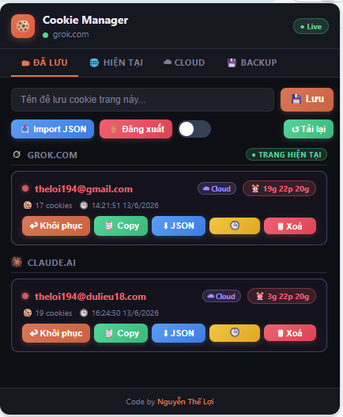

# 🍪 Cookie Manager Pro

> Chrome Extension · Manifest V3 · v6.0

---


Quản lý, lưu, import/export và đăng xuất cookie theo từng trang web — hỗ trợ đồng bộ Cloud với mã hoá AES-256.

---

## ✨ Tính năng

### 📋 Quản lý Cookie cục bộ
- Xem toàn bộ cookie của trang hiện tại theo thời gian thực (tab **Live**)
- Lưu cookie thành **snapshot** đặt tên tuỳ ý, ghi đè hoặc tạo mới
- Import cookie từ file JSON; export snapshot ra JSON
- Áp dụng lại snapshot bất kỳ chỉ bằng một cú click
- Đăng xuất ngay lập tức bằng cách xoá toàn bộ cookie trang hiện tại

### ⏰ Hẹn giờ (Timer)
- Đặt hẹn giờ cho snapshot đang bị giới hạn — đồng hồ đếm ngược đến thời điểm tài khoản hết bị hạn và có thể dùng lại
- Thẻ snapshot tự động đổi trạng thái khi hết giờ, báo hiệu tài khoản đã sẵn sàng
- Thêm ghi chú kèm theo để nhớ lý do bị giới hạn

### ☁️ Đồng bộ Cloud
- Đẩy/kéo snapshot lên server qua API (PHP hoặc Google Apps Script)
- Cookie được **mã hoá AES-256** bằng passphrase trước khi gửi đi
- Hỗ trợ URL API cứng (hardcode) hoặc nhập tay trong giao diện
- Quản lý danh sách snapshot cloud, xoá từng mục hoặc toàn bộ web

### 💾 Backup & Restore
- Xuất toàn bộ dữ liệu ra file `.bak` và lưu lên server backup
- Tải về + khôi phục file `.bak` từ danh sách backup trên server
- Xoá từng file backup không cần thiết

---

## 🚀 Cài đặt Extension

1. Tải và giải nén `Cookies-Manager.zip`
2. Mở Chrome → `chrome://extensions/` → bật **Developer mode**
3. Nhấn **Load unpacked** → chọn thư mục vừa giải nén
4. Ghim extension lên thanh công cụ và dùng ngay

---

## 🔧 Triển khai API

Chọn **một** trong hai phương án bên dưới.

---

### Phương án 1 — PHP (tự host)

**Yêu cầu:** PHP 8.0+, web server có quyền ghi file.

**Bước 1 — Upload file**

```
your-server.com/
└── api.php
└── cookies_data/   ← tự tạo, cần quyền write
└── backup/         ← tự tạo, cần quyền write
```

Upload `api.php` lên hosting. Hai thư mục `cookies_data/` và `backup/` sẽ tự tạo khi API chạy lần đầu (nếu web server có quyền ghi). Nếu không, tạo tay và `chmod 755`.

**Bước 2 — Kiểm tra**

```bash
curl "https://your-server.com/api.php?action=ping"
# {"success":true,"status":"ok","message":"PHP Cookie API v2"}
```

**Bước 3 — Điền vào Extension**

Mở extension → tab **Cloud** → nhập URL:

```
https://your-server.com/api.php
```

---

### Phương án 2 — Google Apps Script (miễn phí)

**Yêu cầu:** Tài khoản Google, một Google Spreadsheet để lưu dữ liệu.

**Bước 1 — Tạo Spreadsheet**

Tạo một Google Spreadsheet mới → copy **Spreadsheet ID** từ URL:

```
https://docs.google.com/spreadsheets/d/SPREADSHEET_ID_HERE/edit
```

**Bước 2 — Tạo Apps Script**

Trong Spreadsheet → menu **Extensions → Apps Script** → xoá code mặc định → dán toàn bộ nội dung file `google-apps-script-api.js`.

**Bước 3 — Điền ID**

Ở đầu file script, thay hai hằng số:

```js
const DATA_SPREADSHEET_ID = 'SPREADSHEET_ID_HERE'; // ID spreadsheet ở bước 1
const BACKUP_FOLDER_ID    = 'FOLDER_ID_HERE';       // ID thư mục Drive (để trống '' nếu bỏ qua)
const API_SECRET_KEY      = 'YOUR_KEY'; Lấy ở tab cloud
```

**Bước 4 — Deploy**

1. Nhấn **Deploy → New deployment**
2. Type: **Web app**
3. Execute as: **Me** · Who has access: **Anyone**
4. Nhấn **Deploy** → copy **Web app URL**

**Bước 5 — Kiểm tra**

```bash
curl "https://script.google.com/macros/s/.../exec?action=ping"
# {"success":true,"status":"ok","message":"Google Apps Script Cookie API v2"}
```

**Bước 6 — Điền vào Extension**

Mở extension → tab **Cloud** → nhập Web app URL vừa copy.

---

## 🔐 Bảo mật

- Cookie lưu cloud được mã hoá **AES-256** phía client trước khi truyền đi — server không thể đọc nội dung raw.
- Đặt passphrase mạnh và không chia sẻ.
- Với PHP: nên đặt `.htaccess` chặn truy cập trực tiếp vào thư mục `cookies_data/` và `backup/`.

---

## ❤️ Đóng góp

- Pull request và các ý tưởng cải tiến luôn được chào đón!

---

## 📫 Liên hệ với tôi

- 📞 **SĐT:** 0963 159 294
- 🌐 **Website:** [lowji194.github.io](https://lowji194.github.io)
- 📌 **Facebook:** [Lowji194](https://facebook.com/Lowji194)

---

## ☕ Nếu bạn thấy dự án này hữu ích, một ly cà phê từ bạn sẽ là động lực tuyệt vời để mình tiếp tục phát triển thêm!

<p align="center">
  
</p>

